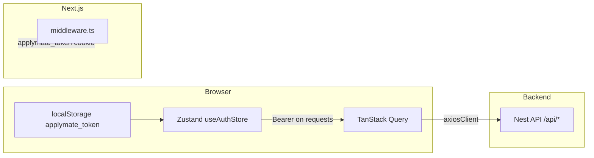

# ApplyMate Frontend — Platform Audit Report

**Date:** 2026-05-06  
**Scope:** `packages/web` (Next.js App Router application)  
**Method:** Codebase review + cross-reference to existing internal docs (`packages/web/docs/FRONTEND_DASHBOARD_ARCHITECTURE.md`).  
**Target depth:** Comparable to a full-stack platform audit (~15–25 printed pages equivalent). Diagrams summarize flows; evidence points to concrete files.

---

## Executive summary

### Strengths

- **Clear product shell:** App Router route groups `(auth)`, `(dashboard)`, `(onboarding)` with middleware-gated protected areas (`packages/web/middleware.ts`).
- **Single HTTP pipeline:** Axios client + envelope handling (`packages/web/src/lib/axios.ts`, `packages/web/src/lib/api.ts`) keeps API semantics consistent for TanStack Query mutations.
- **Dashboard data model is explicit:** Today plan keys and invalidation helpers (`packages/web/src/lib/today-plan.ts` — `todayPlanQueryKey`, `invalidateTodayPlanQueries`).
- **Growth loop wiring exists:** Dedicated hooks and cache keys (`packages/web/src/hooks/useGrowth.ts`); dashboard consumes daily direction, progress, nudges, achievements (`packages/web/src/app/(dashboard)/dashboard/page.tsx`).
- **CV clinic complexity is partially contained:** Improvement apply/accept/reject flows centralized in API layer + CV page / onboarding clinic; field-path–based partial flows documented in code paths.
- **Observability hooks present:** Sentry Next.js integration (`packages/web/next.config.ts`), PostHog import in providers (`packages/web/src/app/providers.tsx`).

### Top risks (product + engineering)

| ID | Risk | Severity | Notes |
|----|------|----------|--------|
| R1 | **Bearer token in `localStorage` + mirrored cookie** | **P0** | XSS or malicious extension can exfiltrate token; cookie is not `httpOnly`. See Security. |
| R2 | **No automated tests in `packages/web`** (no `*.test` / `*.spec` found) | **P0** | Regressions in auth refresh, CV partial accept, dashboard cache are manual-only. |
| R3 | **Large “god” surfaces** (`CVBuilder`, `api.ts`) | **P1** | Hard to reason about correctness at scale; merge conflicts and subtle state bugs. |
| R4 | **Dashboard load = multiple parallel queries** | **P1** | Waterfall/N+1 risk; today-plan uses `staleTime: 0` + `refetchOnMount: 'always'` — fresh but chatty. |
| R5 | **CV improvement apply response parsing** | **P1** | If backend returns `changedFields` in non-object shapes, UI can show “AI suggested change” with empty diff body (investigation noted in code: `applyImprovement` only maps object rows). |
| R6 | **Multi-tab auth** | **P2** | Token cleared in one tab on 401; other tabs may hold stale Zustand until navigation. |

### Priority backlog (suggested)

- **P0:** Security hardening plan for tokens; introduce critical-path tests (auth 401, today-plan invalidation, CV partial flow).
- **P1:** Contract tests or generated types from OpenAPI; reduce dashboard query fan-out; harden CV apply diff parsing + fallback UI.
- **P2:** Virtualize long lists; route-level code splitting audit; CSP headers review.

---

## Architecture map

### Framework & routing

| Layer | Implementation | Evidence |
|--------|----------------|----------|
| Framework | Next.js App Router | `packages/web/src/app/**` |
| Public landing | `/` → `LandingPage` | `packages/web/src/app/page.tsx` |
| Auth | `/login`, `/register` | `packages/web/src/app/(auth)/**` |
| Onboarding | `/onboarding` | `packages/web/src/app/(onboarding)/onboarding/page.tsx` |
| Dashboard | `/dashboard/*` | `packages/web/src/app/(dashboard)/dashboard/**` |
| Middleware | Cookie/header gate | `packages/web/middleware.ts` |

### State management

| Concern | Tool | Notes |
|---------|------|--------|
| Server cache | TanStack Query | Defaults: `staleTime: 60s`, `retry: 2`, `refetchOnWindowFocus: true` (`packages/web/src/app/providers.tsx`) |
| Auth session | Zustand | `packages/web/src/store/useAuthStore.ts` |
| UI chrome | `useUIStore` (per `FRONTEND_DASHBOARD_ARCHITECTURE.md`) | Sidebar collapse, job focus, etc. |
| Ephemeral UI | Toast store | `ToastViewport` in providers |

### Data layer

- **HTTP:** `axiosClient` — base URL from `NEXT_PUBLIC_API_URL`, `withCredentials: true`, Bearer from `localStorage` (`packages/web/src/lib/axios.ts`).
- **API surface:** Large `api` object in `packages/web/src/lib/api.ts` (auth, users, onboarding, cv, jobs, applications, dashboard, growth, etc.).
- **Normalization:** `unwrapApiDataEnvelope`, `ensureArray`, defensive parsing for nested job/CV payloads.

### Auth storage (observed)

| Artifact | Location | Purpose |
|----------|----------|---------|
| Access token | `localStorage` key `applymate_token` | Bearer for API |
| Cookie | `applymate_token=...; path=/` | Middleware route protection |
| Hydration | `hydrateFromStorage` on layout | Restores token into Zustand after full reload (`packages/web/src/app/providers.tsx`) |

**Refresh:** `api.auth.refresh` exists in `api.ts`; **verify** whether login flows and interceptors perform proactive refresh vs reactive 401 redirect (interceptor currently redirects to `/login` on 401 — see Security).

### Environments & build

| Item | Location |
|------|----------|
| API URL | `NEXT_PUBLIC_API_URL` → `API_BASE_URL` (`axios.ts`) |
| Sentry | `withSentryConfig` in `packages/web/next.config.ts` |
| Monorepo shared code | `transpilePackages: ["@applymate/shared"]` |

### Deploy (frontend-specific)

- Standard Next.js production build; Sentry source map upload configured for CI (`silent: !process.env.CI`).
- **Not audited here:** actual hosting (Vercel/Node), edge config, env secret management — confirm with ops.

---

## User journeys (screens → APIs → cache → errors → analytics)

Legend: **Observed** = implemented in repo. **Gap** = missing or needs verification.

### 1) Onboarding

| Step | Screen / route | API calls (typical) | Cache / keys | Errors / empty | Analytics |
|------|----------------|---------------------|--------------|----------------|-----------|
| Enter | `/onboarding` | `GET /onboarding/status` via `useOnboardingStatus` pattern (per internal doc) | Query key patterns in `useOnboarding` | Redirect to `/dashboard` if completed | **Gap:** confirm PostHog events for step completion |
| Upload / progress | Wizard steps | `POST /onboarding`, `POST /cv/parse` (upload) | Invalidate user/onboarding queries on save | Toast on failure | **Gap:** funnel map |
| Resume | Same | Status drives `router.replace` | Local wizard storage cleared on `clearAuth` (`useAuthStore`) | — | — |

**Persistence:** Backend owns canonical progress; client also uses `clearStoredWizard` on logout.

### 2) Auth: register, login, logout, session

| Flow | Route | API | Storage | Notes |
|------|-------|-----|---------|-------|
| Register | `/register` | `POST /auth/register` then login | `setAuth` → LS + cookie | Per `FRONTEND_DASHBOARD_ARCHITECTURE.md` |
| Login | `/login` | `POST /auth/login` | same | Middleware allows `/dashboard` |
| Logout | Sidebar / actions | `POST /auth/logout` + `clearAuth` | Clears LS, cookie, wizard storage | |
| Session expiry | Any | 401 response | Interceptor clears storage + `window.location.href = '/login'` | **Observed:** full page navigation, not silent refresh |

**Multi-tab:** No `storage` event sync found in sampled files — **Gap** for coordinated logout across tabs.

**Evidence:** `packages/web/src/store/useAuthStore.ts`, `packages/web/src/lib/axios.ts`, `packages/web/middleware.ts`.

### 3) Dashboard: today-plan, priorities, mission, continuation, weekly stall, mark-seen, prefetch

| Concern | Implementation | Cache key | Refresh strategy |
|---------|----------------|-----------|------------------|
| Today plan | `useTodayPlan` | `[TODAY_PLAN_QUERY_ROOT, cvProfileId, tz]` from `todayPlanQueryKey` | `staleTime: 0`, `refetchOnMount: 'always'`, `refetchOnWindowFocus: true` |
| Weekly stall | `useWeeklyStallSummary` | Separate root (see `invalidateTodayPlanQueries`) | Invalidated with today-plan family |
| Mark seen | `useDashboardSeen` mutation | `api.dashboard.markSeen()` | Should invalidate today-plan — **verify** callers |
| Prefetch next actions | `TodayPlanPanel` | `api.dashboard.prefetchNextActions` | Bundles cached via `cacheNextActionPrefetchBundle` (`jobHubPrefill`) |

**UI surfaces:** `TodayPlanPanel`, `WeeklyStallSummaryPanel`, growth cards on `dashboard/page.tsx`.

**Growth events from dashboard:** e.g. `daily_direction_completed` via `useTrackGrowthEvent` (confirm wiring in page for CTA).

**Error / empty:** Today plan panel shows error card + retry; skeleton on load (`TodayPlanPanel`).

### 4) Growth (Batch 4)

| Endpoint | Hook | Query key | Client behavior |
|----------|------|-----------|-----------------|
| `GET /growth/daily-direction` | `useGrowthDailyDirection` | `['growth','daily-direction']` | `staleTime: 60s` |
| `GET /growth/progress` | `useGrowthProgress` | `['growth','progress', window]` | Window switcher on dashboard |
| `GET /growth/momentum-nudges` | `useGrowthMomentumNudges` | `['growth','momentum-nudges']` | Top nudges |
| `GET /growth/achievements` | `useGrowthAchievements` | `['growth','achievements']` | Share-safe payloads |
| `GET /growth/immediate-feedback` | `useConsumeImmediateGrowthFeedback` | sessionStorage dedupe by feedback id | Toast |
| `POST /growth/events` | `useTrackGrowthEvent` + `api.growth.trackEvent` | — | **Observed:** failure-swallowed in API layer to avoid crashing flows |

**Evidence:** `packages/web/src/hooks/useGrowth.ts`, `packages/web/src/lib/api.ts` (`growth` namespace).

### 5) Job board / discovery

| Surface | Route | Hooks (examples) | Notes |
|---------|-------|------------------|-------|
| Job board | `/dashboard/job-board` | `useJobDiscovery`, `useJobBoardAiMatch`, bookmarks | Filters + feed — **Gap:** full network trace per filter change |
| Analyze entry | Links to `/dashboard/jobs/analyze` | Prefill via `prefillJobAnalyzerInStorage` | Used from `TodayPlanPanel` |

**Caching:** Per-hook `staleTime` varies — audit each hook file under `packages/web/src/hooks/useJobDiscovery.ts`, `useHubBookmarks.ts`, etc.

### 6) Job Hub: pipeline, notes, reminders, deep links

| Concern | Location | APIs (from `api.ts` grep) |
|---------|----------|---------------------------|
| Hub UI | `packages/web/src/app/(dashboard)/dashboard/jobs/*` | Applications, bookmarks, notes, reminders |
| Deep links | `?jobId=`, `?applicationId=`, etc. | `JobsContent`, `JobHub` components |
| Reminders | Create/list/delete | `/applications/:id/reminders` |

**Trust note:** Duplicate reminder emails were a **backend** scheduler issue per prior handoff; UI should avoid double-toast if API idempotent — **verify** mutation success handlers.

### 7) CV builder: profiles, sections, autosave

| Concern | Implementation |
|---------|----------------|
| Profiles list | `useCVProfiles`, `useCVProfileById` |
| Sections | `useCVSections`, `useUpdateCVSection` — PATCH section rows |
| Score | `useCVScore`, `useRunCvDetailedScore` |
| Improvements list | `useCVImprovements` — key `['cv','improvements', profileId\|\|'default']`, `staleTime: 60s` |
| Large editor | `CVBuilder` — local `useState` for `data`, merge from `initialData` on section identity changes |

**Autosave / debounce:** Implemented inside `CVBuilder` / section update hooks — **Gap:** document exact debounce ms and conflict strategy (optimistic vs server wins).

**Evidence:** `packages/web/src/components/cv/CVBuilder.tsx` (thousands of lines), `packages/web/src/hooks/useUpdateCVSection.ts`.

### 8) CV clinic: improvements, apply, partial/full accept

**Observed contract (frontend intent):**

- `POST /cv/improvements/:pointer/apply` → `changedFields[].fieldPath`, `draftHash`, `improvementId`.
- Partial accept/reject sends `acceptedFields` / `rejectedFields` as **fieldPath** values + `draftHash`.
- After partial success, client re-`apply` with latest `improvementId` to refresh draft state.
- Full accept may apply `diffPreview.after` locally for instant preview (`cv/page.tsx` — `instantPreviewPatch`).

**Files:** `packages/web/src/lib/api.ts` (`applyImprovement`, `acceptImprovement`, `rejectImprovement`), `packages/web/src/app/(dashboard)/dashboard/cv/page.tsx`, `packages/web/src/components/onboarding/OnboardingResumeClinic.tsx`, `packages/web/src/components/cv/ImprovementsPanel.tsx`, `packages/web/src/components/cv/CVDocumentPreview.tsx` (`sectionBox` diff UI).

**Risk:** `applyImprovement` only maps **object** `changedFields` entries; empty `changedFields` yields banner without diff body — **correctness gap** for some backend responses.

### 9) Spellcheck

**Observed:** `CVBuilder` maintains `spellIssuesByField`, listens to `cv:spell-issue:apply` / `dismiss` custom events, prompts user to re-run check when text conflicts (`toast` messages in `CVBuilder.tsx`).

**Gap:** Document backend hash contract in this report only at high level — confirm `issueId` / content hash alignment with API responses in `api.ts` spell endpoints (search `/cv/spell` or similar).

### 10) Tailoring

**APIs in `api.ts`:** `tailor`, `tailor-draft`, accept/reject draft sections — **Gap:** full journey map per UI entry (`JobsAnalyzeContent`, tailor modals).

### 11) AI assistant in builder

**Flow:** `api.cv.assistantCommand` returns clarify vs patch; `CVPage` sets `assistantPendingPatch` + `externalPatch` / nonce into `CVBuilder` (`externalPatch` merge in `CVBuilder`).

**Evidence:** `cv/page.tsx` `runAssistantCommand`, `CVBuilder` `useEffect` on `externalPatch`.

### 12) Notifications / toasts / email deep links

| Surface | Implementation |
|---------|----------------|
| Toasts | `ToastViewport`, `useToast` |
| Notification prefs | `NotificationsTab` — includes `dailyGrowthDigest` |
| Email deep links | **Gap:** not systematically traced; depends on backend email templates |

---

## API contract compliance checklist

| Requirement | Status | Evidence / gap |
|-------------|--------|----------------|
| Partial CV: use `fieldPath` not labels | **Intended OK** | Accept/reject uses `fieldPath` from `changedFields`; labels for display only |
| Pointer: prefer `improvementId` from apply | **Intended OK** | `ImprovementsPanel` sets pointer from `result.improvementId`; sequential re-apply uses response id |
| 409 / 404 structured recovery | **Partial** | `cv/page.tsx` handles `IMPROVEMENT_STALE_DRAFT`, `INVALID_FIELD_SELECTION`, `STALE_INDEX` with refresh/retry |
| Dashboard continuation vs unified priorities | **Partially client-filtered** | `TodayPlanPanel` uses backend IDs/routes; diagnostics rely on backend `consistency` object when present |
| Growth events dedupe keys | **Partial** | `suggested_task_started` sends `dedupeKey` from `unifiedPriorityDedupeKey` (`TodayPlanPanel`) |

---

## Trust & correctness QA matrix

| Scenario | Expected | Observed / gap |
|----------|----------|----------------|
| Mark job applied → no “apply now” for same entity | Dashboard hides invalid priorities | `invalidByLiveState` + `appliedApplicationIds` in `TodayPlanPanel` — **verify** against all backend priority kinds |
| Full accept improvement → suggestion not immediately reappearing | List refresh + resolved filter | `mergeCvImprovementsForDisplay` filters `resolved`; cache update on accept — **backend may regenerate** new suggestion (documented as product behavior) |
| 3+ sequential partial accepts | No stale pointer | Client re-applies after partial; **monitor** for backend edge cases |
| Reminder fires once | Single notification | **Backend** idempotency; UI should not duplicate toast on retry — **verify** |
| Growth `trackEvent` 500 | No crash | **Observed:** try/catch in `api.growth.trackEvent` |

---

## Performance & UX at scale

| Topic | Assessment |
|-------|------------|
| Bundle / code splitting | **Gap:** no systematic route-level `dynamic()` audit in this pass; `next.config` focuses on Sentry + shared transpile |
| List virtualization | **Gap:** job lists and improvement lists appear to render full lists — risk for power users |
| React Query defaults | Global `staleTime: 60s` **except** today-plan (`0`) — aggressive freshness, more network |
| Waterfalls | Dashboard page composes many hooks — profile + plan + growth + history; **measure** in browser Performance tab |
| Prefetch | Today plan prefetches next-action bundle — **good** |
| Skeletons | Used in dashboard tiles and panels |

**Can we support thousands of concurrent users without degrading UX?**

- **Frontend-only answer:** concurrency is not the bottleneck; **per-user client work** is. Risks are **bundle size**, **main-thread work** in `CVBuilder`, **unbounded lists**, and **chatty refetch** (today-plan). Mitigations: virtualization, code splitting, service worker caching for static assets, raising today-plan `staleTime` with targeted invalidation, Web Workers for spellcheck if needed.

---

## Security & privacy (client)

| Topic | Finding |
|-------|---------|
| Token storage | **High risk:** Bearer in `localStorage` + non-httpOnly cookie mirror — XSS impact is session theft |
| `withCredentials: true` | Cookie-based CSRF surface if backend uses session cookies — **confirm** backend CSRF strategy |
| XSS | User job descriptions, CV text rendered — audit rich text components; prefer sanitization for any HTML |
| Logging | **Gap:** grep for `console.log` with tokens in production builds; Sentry PII scrubbing policy not verified in repo |
| CSP | **Gap:** headers not defined in sampled `next.config` — rely on hosting layer |

---

## Accessibility & quality

| Area | Status |
|------|--------|
| Modals | **Gap:** full keyboard trap audit not done |
| Priority cards | `TodayPlanPanel` uses links/buttons — **verify** `aria-label` on badge-only controls |
| CV preview | Complex nested controls — **high risk** for focus management |

---

## Observability

| Tool | Config | Gap |
|------|--------|-----|
| Sentry | `withSentryConfig` | Sampling, PII rules — confirm in Sentry project settings |
| PostHog | `@/lib/posthog` imported in providers | Event catalog not exported as single doc |
| Analytics | `trackFunnelEvent` (`actionFunnel`) | Map all events to funnel definitions |

---

## Code health

| Smell | Example | Recommendation |
|-------|---------|----------------|
| God modules | `api.ts`, `CVBuilder.tsx` | Split by domain; code generation for API types |
| Duplication | CV page vs onboarding clinic for diff logic | Shared hook `useCvImprovementDiffSession` |
| Tests | **None found** under `packages/web` | Add Playwright for auth + dashboard; Vitest for parsers |

**Type safety:** TypeScript in strict mode — **verify** `tsconfig`; API types largely hand-written in `api.ts`.

---

## Conclusion

The frontend is **feature-complete for core loops** (auth, dashboard, jobs, CV, growth) with a **coherent networking layer** and **explicit cache keys** for high-churn dashboard data. The largest **production risks** are **client token storage**, **lack of automated tests**, and **very large UI modules** that will slow iteration and hide regressions. **Performance at scale** is less about concurrent users per se and more about **main-thread cost, list rendering, and refetch policy**.

---

## Appendix A — Red / yellow / green scorecard

| Area | Grade | Comment |
|------|-------|---------|
| Onboarding | 🟡 | Works; needs tests + analytics map |
| Auth | 🟡 | Clear flows; token storage is red-flag |
| Dashboard | 🟡 | Strong; today-plan very fresh → noisy |
| Jobs / Hub | 🟡 | Broad surface; needs journey tests |
| CV / Clinic | 🟡 | Complex; parser edge cases |
| AI surfaces | 🟡 | Patch merge works; clarify flow brittle |
| Performance | 🟡 | No virtualization audit |
| Security | 🔴 | localStorage bearer |
| A11y | 🟡 | Not systematically verified |
| Tests | 🔴 | Missing |

---

## Appendix B — Key file index (quick navigation)

| Path | Purpose |
|------|---------|
| `packages/web/middleware.ts` | Route auth gate |
| `packages/web/src/lib/axios.ts` | HTTP client, 401 handling |
| `packages/web/src/lib/api.ts` | All API methods |
| `packages/web/src/app/providers.tsx` | React Query + auth hydrate |
| `packages/web/src/store/useAuthStore.ts` | Token + user |
| `packages/web/src/lib/today-plan.ts` | Today plan types + query helpers |
| `packages/web/src/hooks/useTodayPlan.ts` | Today plan query behavior |
| `packages/web/src/hooks/useGrowth.ts` | Growth queries + feedback |
| `packages/web/src/components/dashboard/TodayPlanPanel.tsx` | Priorities UI + prefetch + growth click |
| `packages/web/src/app/(dashboard)/dashboard/page.tsx` | Dashboard composition |
| `packages/web/src/app/(dashboard)/dashboard/cv/page.tsx` | CV clinic / diff / accept |
| `packages/web/src/components/cv/CVBuilder.tsx` | Editor + spell + merge |
| `packages/web/next.config.ts` | Sentry |

---

## Appendix C — Optional follow-up doc

If the team wants a **shorter engineering brief** separate from this audit, add `docs/frontend-audit-brief.md` with scope and RACI only (this file remains the evidence-heavy audit).

---

*End of report.*
